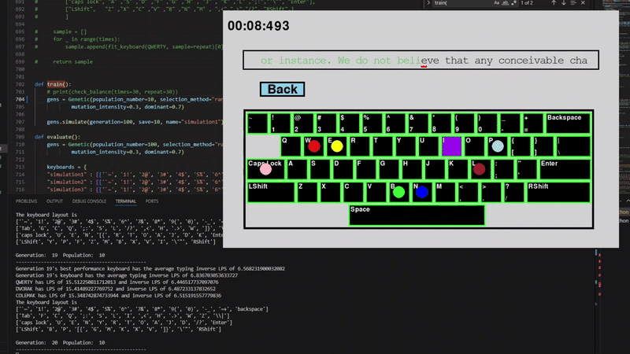

# Keyboard Layout Efficiency

This is a personal A-level STEMCOM research project exploring the characteristics that make a keyboard layout "efficient." The project applies genetic algorithms to evolve and evaluate keyboard layouts based on performance metrics.



## Overview

This repository includes:

* Source code for keyboard layout testing and evolutionary algorithm
* Source code for the analysis ipynb file
* A PDF report detailing the methodology, implementation, and results
* The 3 saved keyboard generated from the algorithm used for the paper

**For copyrights reasons, some of the data in sample text is cleared, only the one generated is used (which will be mentioned later)**

## Objective

The project investigates which design features contribute to a keyboard layout’s overall efficiency. Efficiency is analyzed through typing speed. Evolutionary algorithms are used to explore optimal and near-optimal keyboard configurations. From there a analysis if produce to find the similarities of those keyboard, drawing to the final conclusion.

## Technologies Used

* **Python 3**
* **Pygame** – GUI for interactive testing
* **Pandas, Matplotlib, Seaborn** – data analysis and visualization
* **Requests, BeautifulSoup** – lightweight web scraping for data preparation
* **PyPDF2** – PDF report handling

## Dataset

Most of the data are removed due to copyright reasons, but you still can download and use your own data. At the end of the day, they are just text - there are some helper functions inside the **processing.py** file

The dummy text is generated and taken from a [Random Text generator](https://randomtextgenerator.com/) website

Structure: 

sample_text/ <br>
├── articles <br> 
├── books <br>
├── code <br>
├── dummy <br>

## Project Report

The full research write-up is available here:
[📄 Report.pdf](./report/keyboard.pdf)

## Getting Started

### Installation

1. Clone the repository:

   ```bash
   git clone https://github.com/your-username/keyboard-layout-efficiency.git
   cd keyboard-layout-efficiency
   ```
2. Install the required dependencies:

   ```bash
   pip install -r requirements.txt
   ```

### Running the Project

#### Keyboard Testing GUI

Use this module to interactively test typing performance and layout ergonomics:

```bash
python main.py
```

#### Evolutionary Algorithm Runner

This script runs the genetic algorithm to optimize layouts:

```bash
python evolution.py --train
```
for training or 

```bash
python evolution.py --eval
```
for evaluating


Configuration parameters (e.g., population size, mutation rate) can be adjusted directly in the script.

## License

This project uses a dual-license setup:

- 🧠 **Source Code** — [MIT License](./LICENSE)
- 📑 **Report, Dataset, and Media** — [Creative Commons Attribution 4.0 International (CC BY 4.0)](./report/LICENSE)

- You may freely use, modify, and share the code under the MIT License.
- You may share and adapt the research content and visuals with proper attribution.

---

## Contact & References

- **Author:** Gia Luong Vu  
- **LinkedIn:** [https://linkedin.com/in/gia-luong-vu-38b04728b](https://linkedin.com/in/gia-luong-vu-38b04728b)  

---

Feel free to explore, learn from, and adapt this project.
